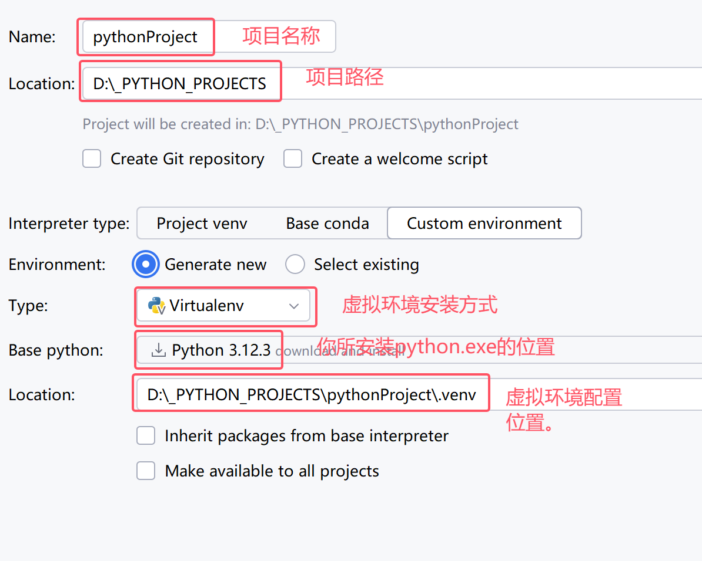

# 环境的安装与运行

[TOC]

## 1、python环境的安装

> 只能在pycharm的venv中使用，全局安装的方式

参考下载地址：[Download Python | Python.org](https://www.python.org/downloads/)

如图所示：

安装的注意点：

+ 安装的位置尽量不要选择C盘（python在默认环境下，会在对应的位置缓存三方库的内容）
+ 勾选`add to path`选项（让python可以存在于全局环境变量中）

测试下载安装的环境：

`WIN + R`启动运行窗口，并在运行窗口中输入`cmd`，回车会启动命令提示符窗口

在窗口中输入`python --version`

如果要从事大语言模型相关的内容，可以使用`miniconda3`

## 2、Miniconda3

参考：[docs.anaconda.com](https://docs.anaconda.com/miniconda/)

下载完成后，双击运行安装即可。（忽略安装的python版本，因为conda是在每个项目中新建一个python的环境）

> 注意： Miniconda3 会默认在C盘进行后续的虚拟环境安装，因此如果你的环境需要重新设置，可以参考如下地址的博客：[Miniconda更改虚拟环境创建路径-CSDN博客](https://blog.csdn.net/mdong9/article/details/142883906)

## 3、Pycharm

参考：[Download PyCharm: The Python IDE for data science and web development by JetBrains](https://www.jetbrains.com/pycharm/download/?section=windows)

双击安装上述的软件，即可。

## 4、如何在Pycharm中创建第一个项目

1、通过python + pycharm的新建方式

+ 全局安装方式

+ 局部虚拟环境安装

  

2、通过miniconda + pycharm的新建方式

## 5、安装环境的依赖（矩阵、图表绘制）

打开左下角的Terminal选项，进入到控制台

安装一些常用的库

