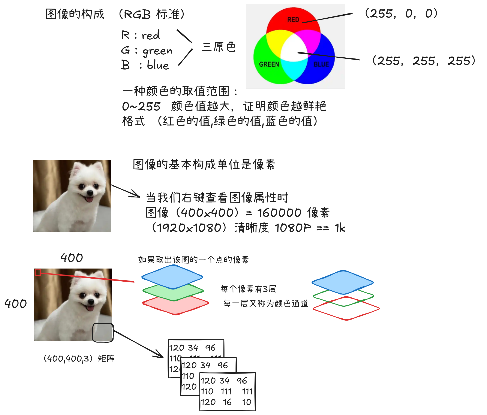
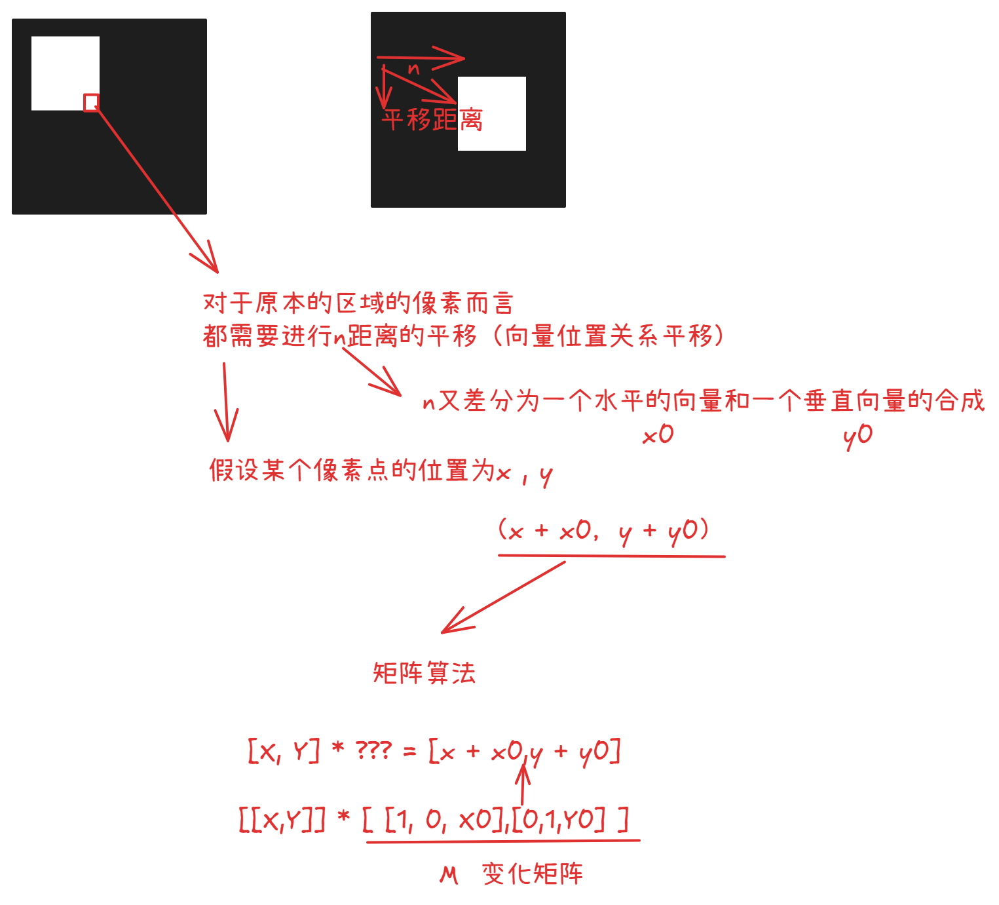
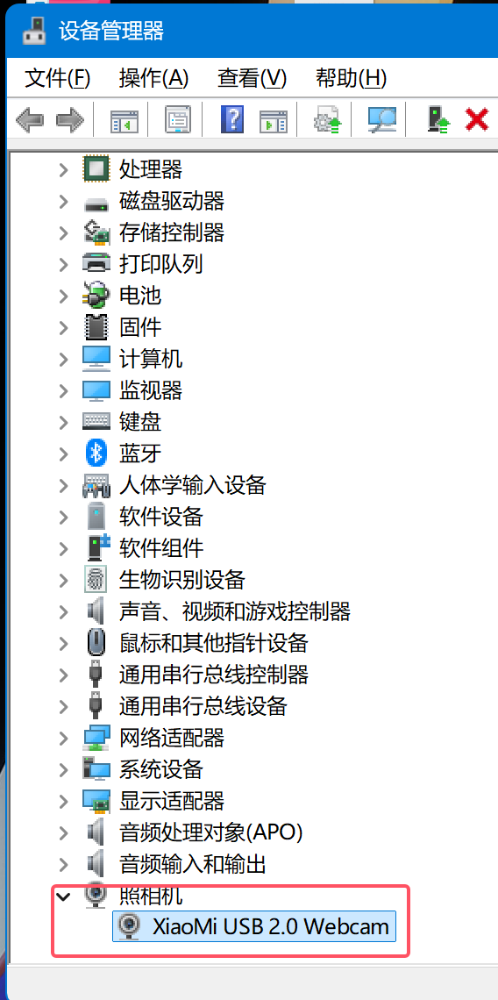
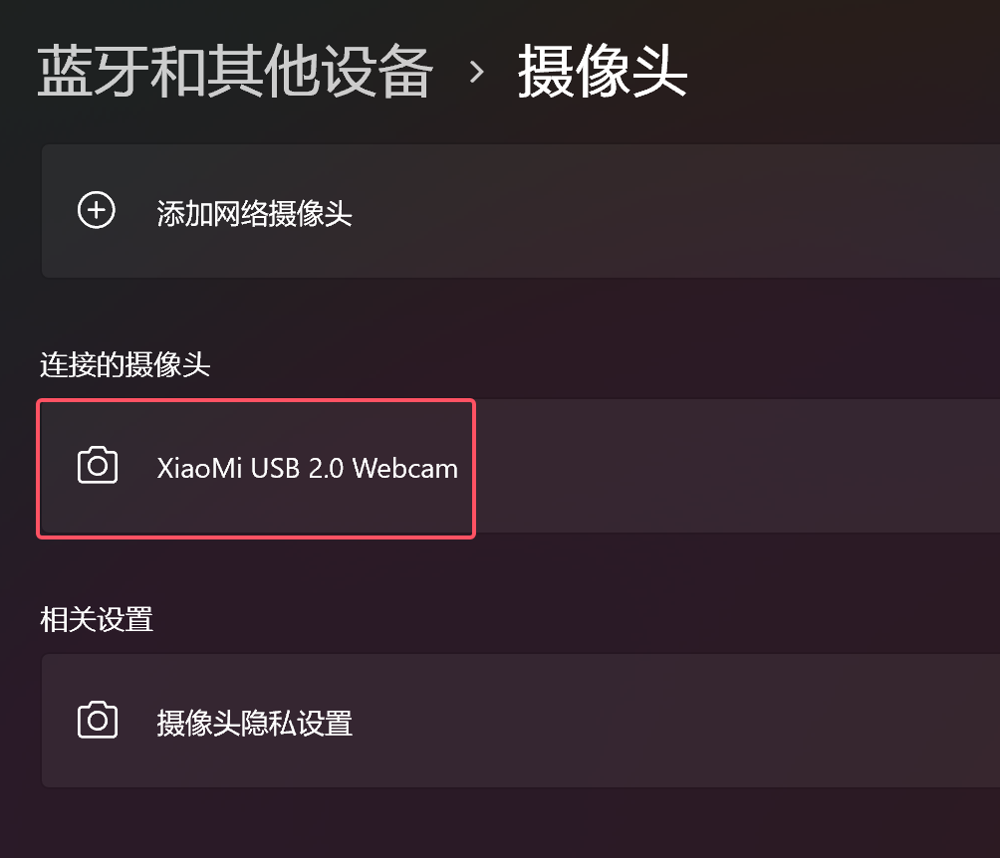
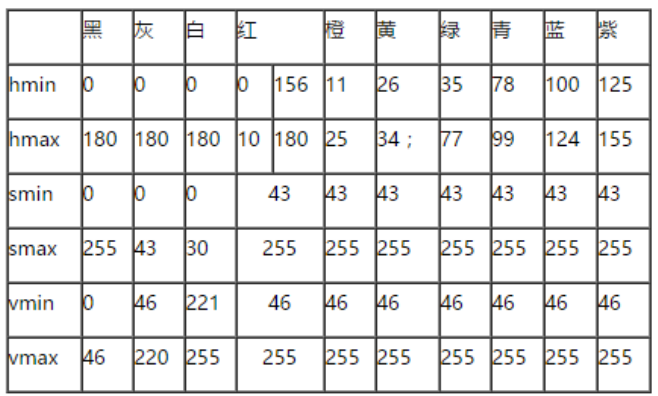

# opencv

> 跨平台的开源视觉库，是图像处理的核心内容
>
> opencv在平台中有C++版本、python版本

+ C++版本主要应用在硬件中（飞思卡尔竞赛、电子红外线......）
+ python版本 作为模型的视觉数据集处理

文档参考地址：[Releases - OpenCV](https://opencv.org/releases/)


## 安装opencv库

```
pip install opencv-python
```

引入：

```
import cv2
```


## 关于图像理解




## 关于图像的变换




## 关于摄像头的打开

在设备管理看到设备



可以在windows的设置中启动摄像头



如果上述的摄像头并不能启动，说明该设备的驱动有问题，因此建议重装驱动。


## HSV颜色对照表


