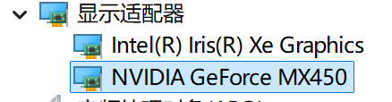
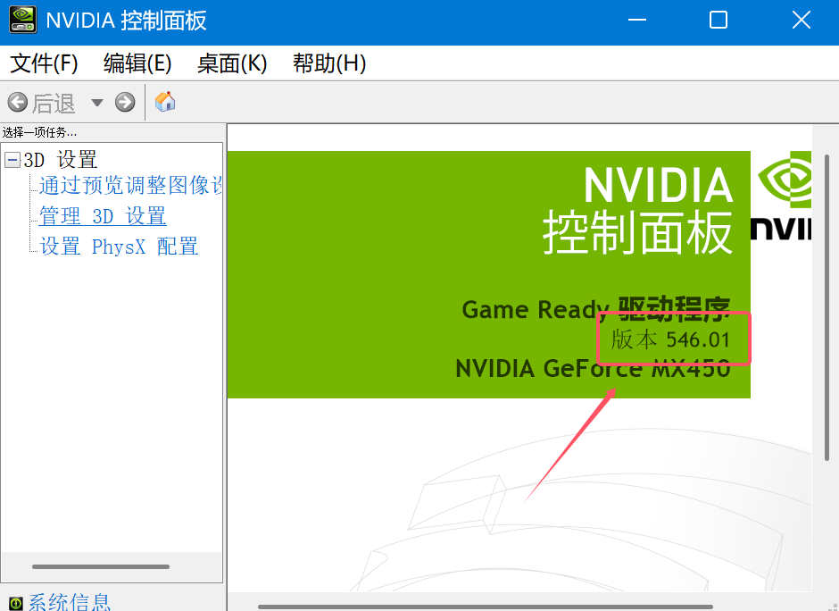
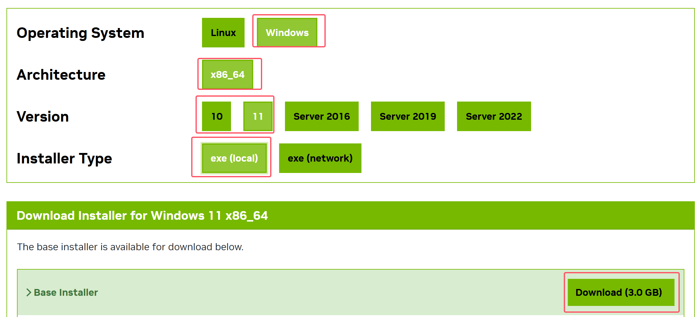
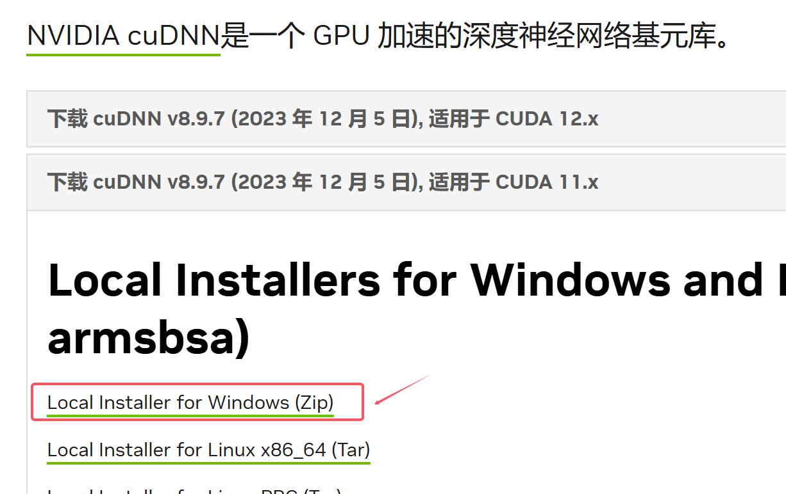
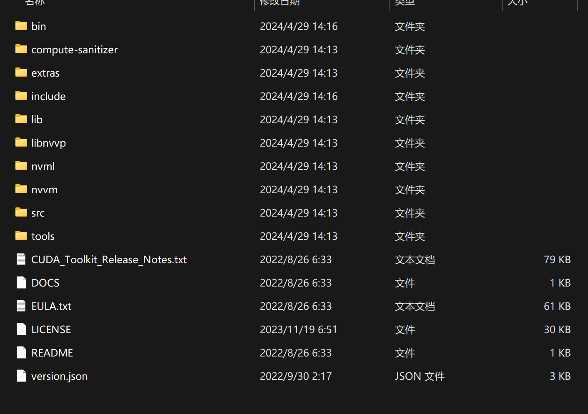
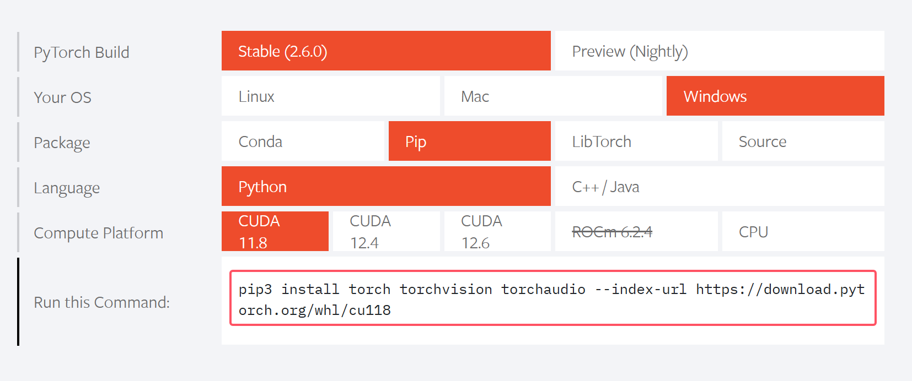
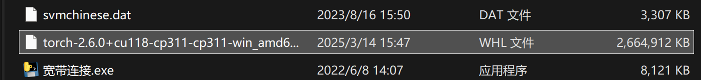
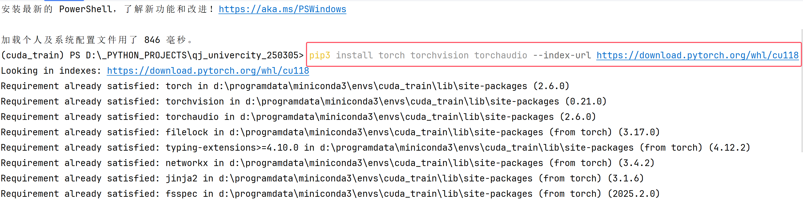

# 模型使用GPU进行推理


## CUDA 安装


[TOC]


### 环境的确认

1、在`设备管理`中确认已包含`Nvidia`显卡：



2、在显卡驱动中确认显卡驱动在比较新的版本下：




### 下载CUDA

CUDA下载的版本，只有11.8 、12.4、12.6


[CUDA Toolkit 11.8 Downloads | NVIDIA Developer](https://developer.nvidia.com/cuda-11-8-0-download-archive?target_os=Windows&target_arch=x86_64&target_version=11)

[CUDA Toolkit 12.4 Downloads | NVIDIA Developer](https://developer.nvidia.com/cuda-12-4-0-download-archive)


下载对应的内容（建议在网络较好的情况下下载）



下载完成后可以直接默认安装

（如果C盘比较满的情况下，建议最好切换到其他盘进行安装）


### 下载CUDNN

> 加速神经网络运行的模块

CUDNN下载地址：[cuDNN 历史版本 | NVIDIA 开发者](https://developer.nvidia.cn/rdp/cudnn-archive)




上述的CUDNN文件需要在CUDA的根目录下进行解压

在你所安装的盘下找到CUDA的根目录位置（此处以C盘为例）

```
C:\Program Files\NVIDIA GPU Computing Toolkit\CUDA\v11.8
```




## torch 的GPU版本安装

地址：[PyTorch](https://pytorch.org/index.html)


根据你所下载的CUDA版本，复制下载连接



实际下载的安装链接

```
pip3 install torch==2.6.0+cu118 torchvision==2.6.0+cu118 torchaudio --index-url https://download.pytorch.org/whl/cu118
```

> 如果在实际中使用上述的方法去下载，会很慢，可以直接复制下载链接到迅雷中下载，得到一个.whl的文件，将该文件放置到一个英文目录下，即可（此处是直接下载到D盘下）。



然后用`pip`安装

```
pip install 目录\torch-2.6.0+cu118-cp311-cp311-win_amd64.whl
```

根据这个方法，可以去安装torchvision==2.6.0+cu118


如果之前有安装其他版本的torch，那么执行安装命令就会覆盖



一般情况下安装了对应版本的torch的gpu版本后,通过`pip list`查看安装的内容

```
torch  2.60+cu118
torchaudio 2.60+cu118
torchvision 0.21.0+cu118
```


在python代码中，使用代码测试：

```python
import torch

# 当前的torch是否可以使用cuda（GPU训练）
print(torch.cuda.is_available())
```

如果为True证明可以GPU训练，否则不可以。

