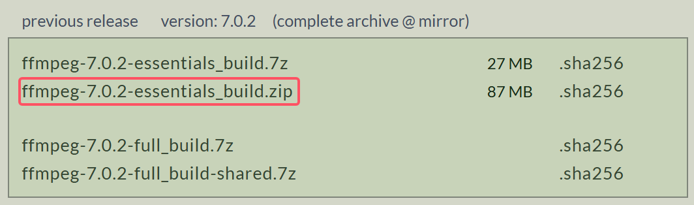

# 远程串流服务


## ffmpeg 安装

官方地址：[Download FFmpeg](https://ffmpeg.org/download.html)


下载对应的版本：



解压文件至目录（非英文，此处目录为D盘下）


配置环境变量


通过命令提示符检查环境安装情况：


## Nginx 安装


官方地址：[nginx: download](https://nginx.org/en/download.html)

如果需要直播推流则使用：[Releases · illuspas/nginx-rtmp-win32](https://github.com/illuspas/nginx-rtmp-win32/releases)


下载完成后，解压该文件到指定位置，并配置环境变量


### nginx的常见命令

启动

```
指定目录/nginx.exe
```


停止

```
指定目录/nginx.exe -s stop
指定目录/nginx.exe -s quit
```


重启

```
指定目录/nginx.exe -s reload
```


重新打开日志文件

```
指定目录/nginx.exe -s reopen
```


启动

```
指定目录/nginx.exe
```


查看与nginx相关的端口

```
tasklist /fi "imagename eq nginx.exe"
```


停止ngnix进程

```
taskkill /f /t /im "nginx.exe"
```


